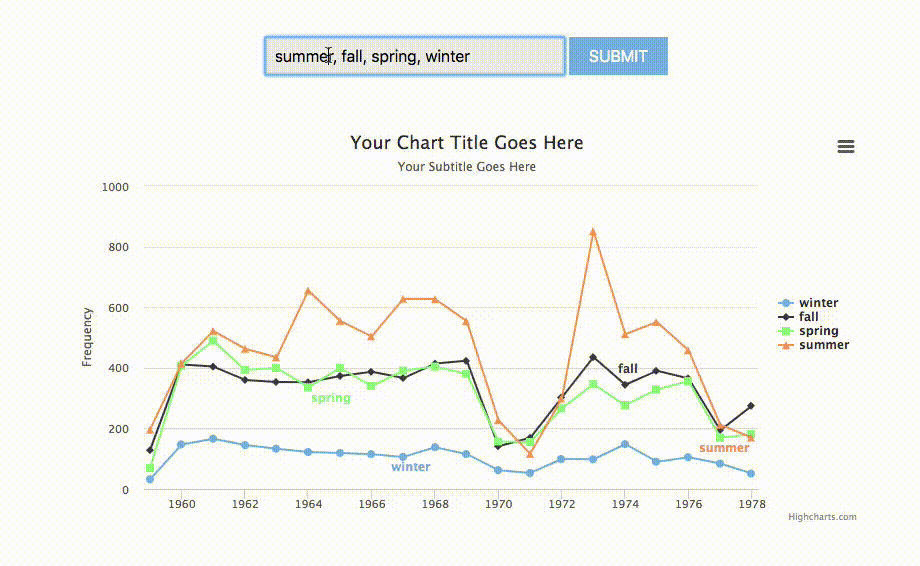

# Minimal Bookworm

A minimal project that allows one to visualize term distributions over time



# Preparing Your Data

To visualize a text collection, one only needs a directory of text files and a JSON metadata file that identifies the publication date of those text files. The text files should be simple plaintext files, while the metadata file should be a list of objects, where each object contains a `filename` and `year` attribute for a single record. Your metadata record may include other fields beside `filename` and `year`. Here's an example metadata record:

```
# sample metadata.json content:
[{
  "filename": "10.2307_109019.txt",
  "year": 1869,
  "title": "Description of Parkeria and Loftusia, Two Gigantic Types of Arenaceous Foraminifera"
},
{
  "filename": "10.2307_109020.txt",
  "year": 1869,
  "title": "On the Structure and Development of the Skull of the Common Fowl (Gallus domesticus)",
}]

# Usage

Once you have your directory of text files and JSON metadata file, you can install the required dependencies by running:

```bash
pip install -r requirements.txt
```

Once the dependencies are installed, you can process your collection by running:

```bash
python process_data.py "path/to/texts/*.txt" "path/to/metadata.json"
```

For example, to process the sample data included in this repository, you can run:

```bash
python process_data.py "sample-data/txt/*.txt" "sample-data/metadata.json"
```

# Viewing Results

To view the results of the data processing, you can start a local server by running:

```
python server.py
```

Then you can open a webbrowser and navigate to port 7000 to see the result!
